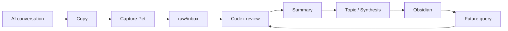
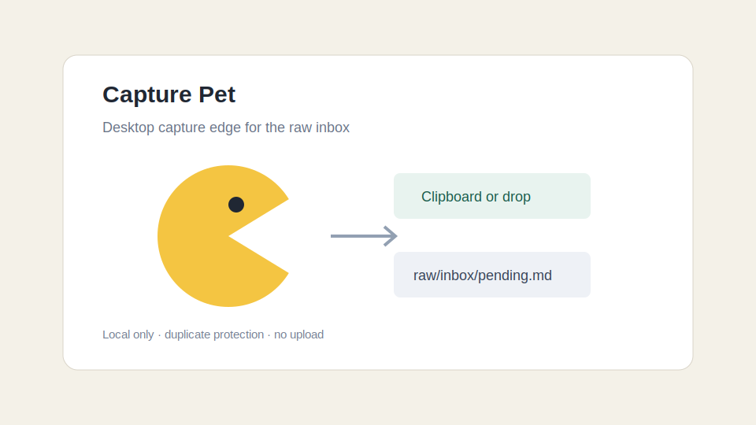
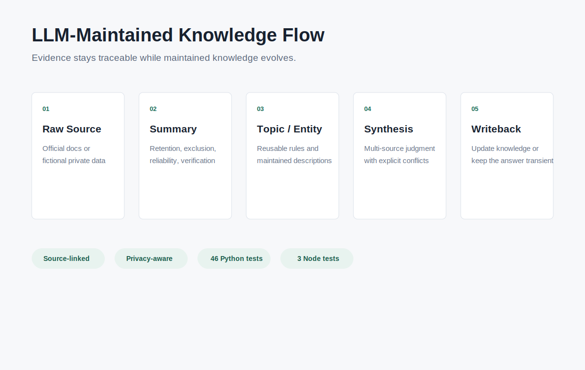
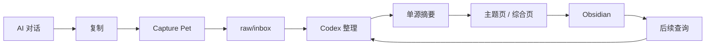

# AI Conversation to Obsidian

> A Codex-driven local workflow that turns valuable AI conversations into
> maintained, source-linked Obsidian knowledge.

[中文说明](#ai-对话沉淀到-obsidian) ·
[Quick start](#quick-start) ·
[Demo](docs/demo-guide.md) ·
[Architecture](docs/architecture.md) ·
[Privacy](docs/privacy-model.md)

## Why This Exists

We increasingly learn by discussing technical problems with ChatGPT, Claude,
Codex, and other AI assistants. These conversations often contain useful
explanations, debugging decisions, and reusable engineering knowledge.

The problem is that we cannot remember all of it. Chat history is fragmented,
searching old conversations is inefficient, and manually rewriting every useful
discussion into Obsidian takes too much effort.

This project provides a simple workflow:

```text
Copy an AI conversation
        ↓
Click Capture Pet
        ↓
Save the complete conversation to raw/inbox
        ↓
Ask Codex to process the pending conversation
        ↓
Codex summarizes, classifies, merges, and links the knowledge
        ↓
Read and maintain the result in Obsidian
```

The original conversation stays in `raw/` so every maintained conclusion can be
traced back to its source.

## What This Project Is

This is a **Codex-driven AI conversation knowledge workflow for Obsidian**.

- **Capture Pet** captures copied conversations into a local raw inbox.
- **Codex** reads the pending inbox and applies the governance rules in
  `AGENTS.md`.
- **Obsidian** is the interface for reading and maintaining the resulting
  Markdown knowledge.
- **Python validators** check pending material, links, page quality, and privacy
  risks.

It is currently a complete reference workflow, not a standalone Codex Skill or
an Obsidian plugin.

## Knowledge Flow



Codex does not simply produce a one-off summary. It decides whether the
conversation should remain raw, receive a source summary, update an existing
topic, create a new topic, or contribute to a multi-source synthesis.

## Requirements

- [Codex](https://openai.com/codex/) as the first supported agent runtime
- An Obsidian vault
- Python 3.11+
- Node.js for Capture Pet

## Quick Start

### 1. Create or open a project folder in Codex

Clone this repository into the folder:

```bash
git clone https://github.com/zykll18/llm-maintained-knowledge-base.git
cd llm-maintained-knowledge-base
```

Alternatively, give Codex the repository URL and ask it to clone the project
into the current workspace.

### 2. Connect the project to Obsidian

Tell Codex:

```text
Use this project with my Obsidian vault at:
/absolute/path/to/my-vault

Read AGENTS.md first, keep original conversations under raw/, and write
maintained knowledge into the wiki directories.
```

Codex should confirm the vault path and preserve the `raw → summary → topic /
synthesis` boundary.

### 3. Start Capture Pet

```bash
npm --prefix capture-pet install
LLM_WIKI_VAULT="/absolute/path/to/my-vault" \
  npm --prefix capture-pet start
```

Capture Pet is currently an Electron development app. It is not yet a signed,
notarized macOS release.

### 4. Capture an AI conversation

1. Copy the useful part of a conversation.
2. Press `Option + Space` if Capture Pet is hidden.
3. Click the pet.
4. The complete text is saved under `raw/inbox/captures/` and added to
   `raw/inbox/pending.md`.

### 5. Ask Codex to organize it

Tell Codex:

```text
Process the conversations currently listed in raw/inbox/pending.md.
Follow AGENTS.md, preserve the raw text, summarize the source, update existing
topics before creating new ones, and record the changes in log.md.
```

Then open the vault in Obsidian and review the generated summary, topic, or
synthesis pages.

## What Capture Pet Does

Capture Pet:

- reads copied or dropped text;
- saves it locally as an immutable raw source;
- adds it to the pending queue;
- skips recent duplicate captures.

Capture Pet does **not** call Codex or summarize the conversation by itself.
Processing currently starts when the user asks Codex to handle the pending
inbox.





## Knowledge Model

- `raw/`: complete original conversations; append-only evidence.
- `wiki/summaries/`: one-conversation summaries and retention decisions.
- `wiki/topics/`: reusable technical knowledge that evolves over time.
- `wiki/entities/`: tools, projects, libraries, papers, and products.
- `wiki/syntheses/`: current multi-source judgments.
- `index.md`: Obsidian navigation.
- `log.md`: ingestion and maintenance history.

## Validation

```bash
python3 scripts/validate_demo.py .
python3 scripts/vault_maintenance.py .
python3 scripts/privacy_scan.py .
python3 -m unittest discover -s tests -v
npm --prefix capture-pet run check
npm --prefix capture-pet test
```

The repository includes a small public fixture to demonstrate the knowledge
layers without publishing real private conversations.

## Privacy

- Captured conversations remain local.
- Capture Pet does not upload content.
- Raw material is never silently promoted to long-term knowledge.
- The public repository is built from reviewed fixtures rather than copied from
  a private vault.
- Pattern-based privacy scanning supports, but does not replace, manual review.

See [Privacy Model](docs/privacy-model.md).

## Current Boundaries

- Codex is currently required for the supported summarization and writeback
  workflow.
- The user explicitly starts processing; capture does not trigger Codex
  automatically.
- Knowledge promotion still requires agent judgment and user review.
- Capture Pet is currently run from source and tested primarily on macOS.

## Roadmap

- Package Capture Pet as a local macOS application.
- Add a clearer first-run vault setup flow.
- Add an explicit Codex command or Skill for processing the pending inbox.
- Add more fictional AI-conversation demos.

---

# AI 对话沉淀到 Obsidian

> 一套由 Codex 驱动的本地工作流，把有价值的 AI 对话转化为可维护、可追溯的
> Obsidian 长期知识。

[快速开始](#快速开始) ·
[演示](docs/demo-guide.md) ·
[架构](docs/architecture.md) ·
[隐私模型](docs/privacy-model.md)

## 为什么做这个项目

现在我们经常通过 ChatGPT、Claude、Codex 等 AI 讨论技术问题。对话中会出现
很多有价值的解释、调试过程、技术选择和工程经验。

问题是，我们无法全部记住。聊天记录分散在不同平台，回头搜索效率很低，而把
每段有用对话手工整理到 Obsidian 又需要很多时间。

这个项目把流程简化为：

```text
复制 AI 对话
      ↓
点击 Capture Pet
      ↓
完整原文进入 raw/inbox
      ↓
让 Codex 处理待整理对话
      ↓
Codex 总结、分类、合并并建立链接
      ↓
在 Obsidian 中阅读和维护
```

原始对话始终保留在 `raw/`，因此长期笔记中的结论可以追溯到来源。

## 项目定位

这是一个 **由 Codex 驱动、面向 Obsidian 的 AI 对话知识沉淀工作流**。

- **Capture Pet**：把复制的对话写入本地 raw inbox。
- **Codex**：读取 pending 队列，并按照 `AGENTS.md` 完成判断、总结和回写。
- **Obsidian**：阅读和维护最终 Markdown 知识的界面。
- **Python 检查工具**：检查待处理材料、链接、页面质量和隐私风险。

它目前是一套完整的参考工作流，不是单独的 Codex Skill，也不是 Obsidian
插件。

## 工作流程



Codex 不只是生成一份一次性摘要。它会判断这段对话应该只保留原文、生成
summary、更新已有 topic、新建 topic，还是补充多来源 synthesis。

## 必要条件

- Codex：当前第一版支持的 Agent 执行端
- 一个 Obsidian Vault
- Python 3.11+
- Node.js：用于运行 Capture Pet

## 快速开始

### 1. 在 Codex 中创建或打开项目文件夹

将仓库克隆到项目文件夹：

```bash
git clone https://github.com/zykll18/llm-maintained-knowledge-base.git
cd llm-maintained-knowledge-base
```

也可以直接把仓库链接发给 Codex，让它把项目克隆到当前 workspace。

### 2. 让 Codex 接入 Obsidian

告诉 Codex：

```text
把这个项目接入我的 Obsidian Vault：
/我的/Obsidian/Vault/绝对路径

先读 AGENTS.md。原始对话保存在 raw/，整理后的长期知识写入 wiki/，
不要修改原始材料。
```

Codex 应先确认 Vault 路径，并保持 `raw → summary → topic / synthesis` 的
分层边界。

### 3. 启动 Capture Pet

```bash
npm --prefix capture-pet install
LLM_WIKI_VAULT="/我的/Obsidian/Vault/绝对路径" \
  npm --prefix capture-pet start
```

Capture Pet 当前是 Electron 开发版，还不是已签名、公证的 macOS 安装包。

### 4. 捕获 AI 对话

1. 复制有价值的 AI 对话。
2. 如果 Pet 被隐藏，按 `Option + Space` 唤醒。
3. 点击 Pet。
4. 完整原文会保存到 `raw/inbox/captures/`，同时加入
   `raw/inbox/pending.md`。

### 5. 让 Codex 整理

告诉 Codex：

```text
处理 raw/inbox/pending.md 中尚未整理的对话。
按照 AGENTS.md 保留 raw 原文，先生成 summary，优先更新已有 topic，
必要时再写 synthesis，并在 log.md 记录本次处理。
```

处理完成后，在 Obsidian 中检查生成或更新的 summary、topic 和 synthesis。

## Capture Pet 负责什么

Capture Pet 会：

- 读取剪贴板或拖入的文本；
- 将完整内容保存为不可变的 raw source；
- 把新材料加入 pending 队列；
- 跳过短时间内的重复捕获。

Capture Pet **不会**自行调用 Codex，也不会自行总结。当前必须由用户在 Codex
中发出“处理 pending 对话”的指令。

## 知识分层

- `raw/`：完整原始对话，只增不改。
- `wiki/summaries/`：单次对话摘要和入库判断。
- `wiki/topics/`：持续更新的可复用技术知识。
- `wiki/entities/`：工具、项目、库、论文和产品。
- `wiki/syntheses/`：多来源后的当前最佳判断。
- `index.md`：Obsidian 导航入口。
- `log.md`：导入和维护记录。

## 验证

```bash
python3 scripts/validate_demo.py .
python3 scripts/vault_maintenance.py .
python3 scripts/privacy_scan.py .
python3 -m unittest discover -s tests -v
npm --prefix capture-pet run check
npm --prefix capture-pet test
```

公开仓库只使用专门编写的演示材料，不包含真实私人对话。

## 隐私边界

- 捕获的对话只保存在本地。
- Capture Pet 不上传内容。
- raw 材料不会被自动当成长期知识。
- 公开仓库通过白名单材料构建，不从私人 Vault 复制后再删除。
- 隐私扫描只能辅助人工检查，不能替代人工判断。

## 当前边界

- 第一版依赖 Codex 完成总结和写回。
- 点击 Pet 后不会自动触发 Codex，用户需要主动发出处理指令。
- 知识升级仍需要 Agent 判断和用户复核。
- Capture Pet 当前从源码启动，主要在 macOS 上测试。

## 后续计划

- 将 Capture Pet 打包成本地 macOS 应用。
- 增加更清晰的首次 Vault 配置流程。
- 封装明确的 Codex 命令或 Skill 来处理 pending inbox。
- 增加更多虚构 AI 对话演示。
