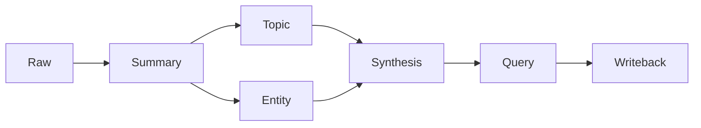

# LLM-Maintained Knowledge Base

> A privacy-aware, source-linked pipeline for turning raw AI-era information into maintained knowledge.

[Five-minute demo](docs/demo-guide.md) · [Architecture](docs/architecture.md) · [Privacy model](docs/privacy-model.md)

## Architecture



Raw evidence is preserved. Summaries record ingestion decisions. Topics and
entities hold reusable knowledge; syntheses represent the current multi-source
judgment.

## What It Demonstrates

- Chat export import, deduplication, and same-source updates
- Pending-source, broken-link, orphan, and rewrite-candidate checks
- Source reliability and verification boundaries
- Query-to-wiki writeback
- Privacy scanning before release
- Optional community-search adapters
- A tested Electron desktop capture inbox

## Five-Minute Demo

The repository includes an original paraphrase of official Python `venv`
documentation and a fully fictional privacy-sensitive note. Follow the
[demo guide](docs/demo-guide.md) from raw source through synthesis.

## Capture Pet

Capture Pet writes clipboard or dropped text to a local raw inbox and pending
queue. Its filesystem core has Node tests and does not upload content.


## Setup

```bash
git clone <repository-url>
cd llm-maintained-knowledge-base
python3 scripts/validate_demo.py .
```

Python 3.11+ is sufficient for the core. External search tools are optional.

## Tests

```bash
python3 -m unittest discover -s tests -v
python3 scripts/vault_maintenance.py .
python3 scripts/privacy_scan.py .
npm --prefix capture-pet install
npm --prefix capture-pet run check
npm --prefix capture-pet test
```

## Privacy Model

The repository uses allowlist migration. It is built from reviewed code and
deliberately authored fixtures, not by copying and cleaning a private vault.
See the [privacy model](docs/privacy-model.md).

## Limitations

- Promotion to long-term knowledge still requires judgment.
- Community search results are signals, not verified facts.
- Pattern-based privacy scanning still requires manual review.
- Capture Pet is currently tested primarily on macOS.

## Roadmap

- Add CI after the first public push
- Add more public-source fixtures
- Package Capture Pet for more desktop platforms
- Evaluate a read-only web demo

---

# LLM 持续维护型知识库

> 一个把 AI 时代的原始材料转化为可维护、可追溯长期知识的隐私友好流水线。

[五分钟演示](docs/demo-guide.md) · [架构](docs/architecture.md) · [隐私模型](docs/privacy-model.md)

## 架构


`raw` 保留证据，`summary` 记录入库判断，`topic/entity` 保存可复用知识，
`synthesis` 表示多来源后的当前最佳判断。

## 项目展示内容

- Chat Memo 导入、去重和同源更新
- pending raw、断链、孤立页和重写候选检查
- 来源可信度与待验证边界
- 查询后的知识回写
- 发布前隐私扫描
- 可选社区搜源适配器
- 带测试的 Electron 桌面捕获入口

## 五分钟演示

仓库包含 Python 官方 `venv` 文档的原创转述，以及完全虚构的隐私型笔记。
按照[演示指南](docs/demo-guide.md)查看从 raw 到 synthesis 的完整过程。

## Capture Pet

Capture Pet 把剪贴板或拖入文本写入本地 raw inbox 和 pending 队列。存储
核心有 Node 测试，不会上传内容。

## 安装

```bash
git clone <repository-url>
cd llm-maintained-knowledge-base
python3 scripts/validate_demo.py .
```

核心功能只需要 Python 3.11+；外部搜源工具均为可选。

## 测试

```bash
python3 -m unittest discover -s tests -v
python3 scripts/vault_maintenance.py .
python3 scripts/privacy_scan.py .
npm --prefix capture-pet install
npm --prefix capture-pet run check
npm --prefix capture-pet test
```

## 隐私模型

公开仓库采用白名单迁移：只引入审查过的代码和专门编写的演示材料，不复制
私人 vault 后再删除。详见[隐私模型](docs/privacy-model.md)。

## 当前限制

- 系统不会完全自动决定哪些材料值得升级为长期知识。
- 社区搜索结果只能作为信号，不能直接当事实。
- 模式匹配式隐私扫描仍需要人工复核。
- Capture Pet 当前主要在 macOS 上验证。

## 路线图

- 首次公开推送后增加 CI
- 增加更多公开来源案例
- 为 Capture Pet 增加多平台打包
- 评估只读 Web 演示
