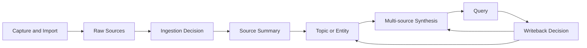

# Architecture

## System Flow

## Boundaries

- Ingestion tools produce raw Markdown; they do not directly rewrite knowledge.
- `raw/` preserves evidence and summaries record retention decisions.
- Topics and entities hold reusable knowledge.
- Syntheses represent the current multi-source judgment.
- Queries explicitly decide whether and where to write back.

The core demo is offline. External search adapters are optional collection
edges, and their results remain raw signals until reviewed.

