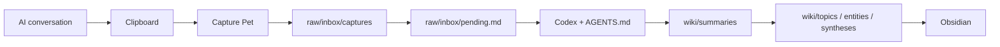

# Architecture

## Product Boundary

The first supported product flow is intentionally narrow:



## Components

### Capture Pet

- Runs locally as an Electron application.
- Reads copied or dropped text.
- Writes the complete source to `raw/inbox/captures/`.
- Adds a repository-relative entry to `raw/inbox/pending.md`.
- Does not call an LLM and does not rewrite knowledge.

### Raw Inbox

- Preserves the original AI conversation.
- Separates capture from knowledge promotion.
- Provides the pending queue that Codex reviews.

### Codex

- Is the first required supported agent runtime.
- Reads `AGENTS.md`, the pending conversation, `index.md`, and relevant existing
  knowledge pages.
- Creates a source summary and explicitly records the retention decision.
- Updates existing topics or syntheses before creating parallel pages.
- Records important conflicts and maintenance changes.

### Obsidian

- Opens the repository or connected vault as Markdown knowledge.
- Provides navigation, backlinks, search, and user review.
- Does not need a custom plugin for the current workflow.

### Deterministic Validators

- Check pending raw files, broken links, orphan pages, weak links, rewrite
  candidates, merge candidates, and formatting issues.
- Scan the public repository for common privacy risks.
- Support Agent judgment without replacing it.

## Knowledge Layers

```text
raw conversation
    ↓
single-source summary + retention decision
    ↓
reusable topic or entity update
    ↓
multi-source synthesis when justified
    ↓
query and writeback
```

## Runtime Sequence

1. The user copies an AI conversation.
2. Capture Pet stores it locally and queues it.
3. The user tells Codex to process the pending inbox.
4. Codex reads the governance rules and relevant existing pages.
5. Codex preserves the raw source, writes a summary, and updates maintained
   knowledge.
6. The user reviews the result in Obsidian.

## Explicit Non-Goals

- Capture Pet does not automatically trigger Codex.
- The system does not treat every AI answer as a fact.
- The repository is not currently an Obsidian plugin.
- The workflow is not currently packaged as a standalone Codex Skill.
- General web and community collection are not the first-version product focus.

---

# 架构说明

第一版只聚焦一条路径：

```text
AI 对话 → 复制 → Capture Pet → raw/pending → Codex 整理 → Obsidian
```

- Capture Pet 只负责本地捕获，不调用模型。
- `raw/` 保存完整原文，`pending.md` 记录待处理材料。
- Codex 按照 `AGENTS.md` 判断、总结、合并和写回。
- Obsidian 负责阅读、检索、链接和人工复核。
- Python 工具负责确定性的链接、结构和隐私检查。

点击 Pet 不会自动启动总结。用户需要在 Codex 中明确发出处理 pending inbox
的指令。
