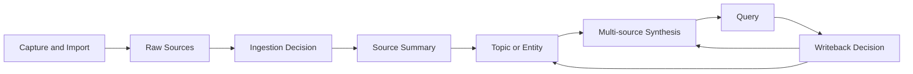
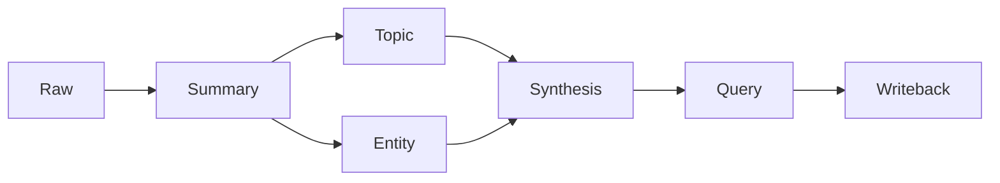

# Public Portfolio Repository Implementation Plan

> **For agentic workers:** REQUIRED SUB-SKILL: Use superpowers:subagent-driven-development (recommended) or superpowers:executing-plans to implement this plan task-by-task. Steps use checkbox (`- [ ]`) syntax for tracking.

**Goal:** Build an interview-ready, bilingual, privacy-safe public repository that demonstrates an LLM-maintained knowledge flow and includes the Capture Pet desktop ingestion application.

**Architecture:** Create every public artifact from an allowlist rather than copying the private vault wholesale. Keep the core pipeline dependency-free with Python standard-library modules, place network-backed search adapters behind optional commands, and extract Capture Pet storage logic into a testable Node module. Use deliberately authored public and fictional fixtures to demonstrate `raw -> summary -> topic/entity -> synthesis -> query writeback`.

**Tech Stack:** Python 3.11+ standard library, `unittest`, Node.js 20+, Electron, Node built-in test runner, Markdown, Obsidian-style wikilinks, Mermaid, Git.

---

## File Map

Files created or maintained by this plan:

- `README.md`: complete bilingual portfolio landing page.
- `LICENSE`: MIT license for public reuse.
- `.gitignore`: blocks private and generated data.
- `.env.example`: documents optional integration variables without values.
- `AGENTS.md`: public knowledge-governance contract.
- `index.md`: demo vault navigation.
- `log.md`: demo ingestion and maintenance history.
- `requirements-dev.txt`: documents that the Python test suite has no third-party requirements.
- `scripts/import_chat_memo.py`: portable Chat Memo import and deduplication.
- `scripts/vault_maintenance.py`: portable vault structure and link validation.
- `scripts/search_last30days.py`: optional last30days adapter with repository-relative paths.
- `scripts/search_agent_reach.py`: optional Agent-Reach adapter with repository-relative paths.
- `scripts/privacy_scan.py`: repository secret, identity, and absolute-path scanner.
- `scripts/validate_demo.py`: validates the published demo flow and required metadata.
- `tests/test_import_chat_memo.py`: importer behavior.
- `tests/test_vault_maintenance.py`: vault maintenance behavior.
- `tests/test_search_last30days.py`: optional search adapter rendering and command construction.
- `tests/test_search_agent_reach.py`: optional platform adapter rendering and command construction.
- `tests/test_privacy_scan.py`: scanner detection and allowlist behavior.
- `tests/test_validate_demo.py`: demo fixture integrity.
- `examples/raw/public-sources/official-python-venv.md`: public official-documentation source fixture.
- `examples/raw/fictional-private-data/meeting-note.md`: fictional privacy-sensitive source fixture.
- `examples/expected-wiki/...`: immutable expected outputs used by tests and reviewer walkthrough.
- `raw/...`: runnable demo vault source material copied from reviewed example fixtures only.
- `wiki/...`: runnable demo vault long-term knowledge pages.
- `capture-pet/lib/capture-store.js`: testable filesystem and pending-queue behavior.
- `capture-pet/test/capture-store.test.js`: Node tests for save, duplicate, and queue behavior.
- `capture-pet/main.js`: Electron shell using `capture-store`.
- `capture-pet/preload.js`: isolated renderer bridge.
- `capture-pet/renderer/*`: capture UI.
- `capture-pet/README.md`: bilingual application guide.
- `capture-pet/package.json`: Electron and test commands.
- `docs/architecture.md`: architecture and data-flow explanation.
- `docs/privacy-model.md`: threat model and release controls.
- `docs/demo-guide.md`: five-minute reviewer walkthrough.
- `docs/images/`: screenshots containing demo-only data.

Before executing migration tasks, set the private source checkout for the
current shell and verify it:

```bash
export PRIVATE_VAULT="$(
  python3 -c 'from pathlib import Path; matches=list((Path.home() / "Documents").glob("*/import_chat_memo.py")); print(matches[0].parent if matches else "")'
)"
test -n "$PRIVATE_VAULT"
test -f "$PRIVATE_VAULT/import_chat_memo.py"
test -f "$PRIVATE_VAULT/vault_maintenance.py"
test -f "$PRIVATE_VAULT/capture-pet/main.js"
```

`PRIVATE_VAULT` is an execution-only environment variable. Its value must never
be written into a tracked public file.

## Task 1: Establish the Public Repository Safety Boundary

**Files:**
- Create: `.gitignore`
- Create: `.env.example`
- Create: `LICENSE`
- Create: `requirements-dev.txt`
- Create: `README.md`

- [ ] **Step 1: Create a root ignore policy before migrating code**

Create `.gitignore` with:

```gitignore
# Python
__pycache__/
*.py[cod]
.pytest_cache/
.coverage
htmlcov/
.venv/
venv/

# Node and Electron
node_modules/
dist/
out/
*.log

# Local configuration and credentials
.env
.env.*
!.env.example
*.pem
*.key

# OS and editor state
.DS_Store
.idea/
.vscode/
.obsidian/workspace.json
.obsidian/workspace-mobile.json

# Private-vault material must never enter this repository
raw/projects/
raw/conversations/private/
private/
secrets/
```

- [ ] **Step 2: Document optional integration variables without values**

Create `.env.example`:

```dotenv
# Optional integrations only. The core demo and test suite require none.
GITHUB_TOKEN=
XAI_API_KEY=
LLM_WIKI_VAULT=
LAST30DAYS_SKILL_DIR=
```

- [ ] **Step 3: Add the MIT license**

Create `LICENSE` using the standard MIT text with:

```text
Copyright (c) 2026 Yuke Zhang
```

- [ ] **Step 4: Declare the dependency policy**

Create `requirements-dev.txt`:

```text
# The Python core and test suite use only the Python 3.11+ standard library.
```

- [ ] **Step 5: Create a non-promotional README skeleton**

Create `README.md` with these headings in this exact order:

```markdown
# LLM-Maintained Knowledge Base

> A privacy-aware pipeline that turns raw sources into maintained, source-linked knowledge.

## Architecture
## What It Demonstrates
## Five-Minute Demo
## Capture Pet
## Setup
## Tests
## Privacy Model
## Limitations
## Roadmap

---

# LLM 持续维护型知识库

> 一个把原始材料转化为可维护、可追溯长期知识的隐私友好流水线。

## 架构
## 项目展示内容
## 五分钟演示
## Capture Pet
## 安装
## 测试
## 隐私模型
## 当前限制
## 路线图
```

- [ ] **Step 6: Verify the foundation contains no machine-specific path**

Run:

```bash
rg -n '/Users/|New project 6|raw/projects' README.md .env.example LICENSE requirements-dev.txt
```

Expected: no output except the intentional `raw/projects/` ignore entry when `.gitignore` is included separately.

- [ ] **Step 7: Commit the repository foundation**

```bash
git add .gitignore .env.example LICENSE requirements-dev.txt README.md
git commit -m "chore: establish public repository boundary"
```

## Task 2: Add Privacy Scanning Before Source Migration

**Files:**
- Create: `scripts/privacy_scan.py`
- Create: `tests/test_privacy_scan.py`

- [ ] **Step 1: Write failing scanner tests**

Create `tests/test_privacy_scan.py`:

```python
import tempfile
import unittest
from pathlib import Path

from scripts.privacy_scan import scan_repository


class PrivacyScanTests(unittest.TestCase):
    def test_detects_secret_and_absolute_home_path(self) -> None:
        with tempfile.TemporaryDirectory() as tmp:
            root = Path(tmp)
            token = "ghp_" + "abcdefghijklmnopqrstuvwxyz123456"
            home_path = "/" + "Users/example/private-vault"
            (root / "leak.md").write_text(
                f"token={token}\npath={home_path}\n",
                encoding="utf-8",
            )

            findings = scan_repository(root)

            kinds = {finding.kind for finding in findings}
            self.assertEqual(kinds, {"secret", "absolute-user-path"})

    def test_detects_email_and_private_journal_path(self) -> None:
        with tempfile.TemporaryDirectory() as tmp:
            root = Path(tmp)
            email = "real.person" + "@example.com"
            (root / "note.md").write_text(
                f"Contact {email}\n",
                encoding="utf-8",
            )
            private_journal = root / "raw" / "projects" / "demo"
            private_journal.mkdir(parents=True)
            (private_journal / "session.md").write_text("# private\n", encoding="utf-8")

            findings = scan_repository(root)

            kinds = {finding.kind for finding in findings}
            self.assertEqual(kinds, {"email", "private-journal-path"})

    def test_ignores_git_metadata_and_expected_placeholders(self) -> None:
        with tempfile.TemporaryDirectory() as tmp:
            root = Path(tmp)
            (root / ".git").mkdir()
            (root / ".git" / "config").write_text(
                "url = git@example.com:demo/repo.git\n",
                encoding="utf-8",
            )
            (root / ".env.example").write_text("GITHUB_TOKEN=\n", encoding="utf-8")

            findings = scan_repository(root)

            self.assertEqual(findings, [])


if __name__ == "__main__":
    unittest.main()
```

- [ ] **Step 2: Run the tests and verify they fail**

Run:

```bash
python3 -m unittest tests.test_privacy_scan -v
```

Expected: `ModuleNotFoundError: No module named 'scripts.privacy_scan'`.

- [ ] **Step 3: Implement the scanner**

Create `scripts/privacy_scan.py`:

```python
from __future__ import annotations

import argparse
import re
from dataclasses import dataclass
from pathlib import Path


IGNORED_PARTS = {".git", "node_modules", "dist", "__pycache__"}
IGNORED_PREFIXES = {Path("docs/superpowers")}
TEXT_SUFFIXES = {
    ".css", ".html", ".js", ".json", ".md", ".py", ".sh",
    ".toml", ".txt", ".yaml", ".yml",
}
PATTERNS = {
    "secret": re.compile(
        r"\b(?:sk-[A-Za-z0-9_-]{8,}|gh[oprsu]_[A-Za-z0-9]{20,}|"
        r"as_sk_[A-Za-z0-9_-]{12,}|Bearer\s+[A-Za-z0-9._~+/-]{12,})\b"
    ),
    "absolute-user-path": re.compile(r"/" + r"Users/[A-Za-z0-9._-]+/"),
    "email": re.compile(r"\b[A-Z0-9._%+-]+@[A-Z0-9.-]+\.[A-Z]{2,}\b", re.IGNORECASE),
}


@dataclass(frozen=True)
class Finding:
    path: Path
    line: int
    kind: str
    excerpt: str


def iter_text_files(root: Path) -> list[Path]:
    return sorted(
        path
        for path in root.rglob("*")
        if path.is_file()
        and path.suffix.lower() in TEXT_SUFFIXES
        and not any(part in IGNORED_PARTS for part in path.relative_to(root).parts)
        and not any(
            path.relative_to(root).is_relative_to(prefix)
            for prefix in IGNORED_PREFIXES
        )
    )


def scan_repository(root: Path | str) -> list[Finding]:
    root_path = Path(root).resolve()
    findings: list[Finding] = []
    private_journal = root_path / "raw" / "projects"
    if private_journal.exists():
        findings.append(
            Finding(
                path=private_journal.relative_to(root_path),
                line=0,
                kind="private-journal-path",
                excerpt="private journal directory exists",
            )
        )
    for path in iter_text_files(root_path):
        if path.name == ".env.example":
            continue
        for number, line in enumerate(
            path.read_text(encoding="utf-8", errors="replace").splitlines(),
            start=1,
        ):
            for kind, pattern in PATTERNS.items():
                if pattern.search(line):
                    findings.append(
                        Finding(
                            path=path.relative_to(root_path),
                            line=number,
                            kind=kind,
                            excerpt=pattern.sub("[REDACTED]", line)[:200],
                        )
                    )
    return findings


def main() -> int:
    parser = argparse.ArgumentParser(description="Scan the public repository for private data.")
    parser.add_argument("root", nargs="?", default=".")
    args = parser.parse_args()
    findings = scan_repository(args.root)
    for finding in findings:
        print(f"{finding.path}:{finding.line}: {finding.kind}: {finding.excerpt}")
    print(f"Privacy findings: {len(findings)}")
    return 1 if findings else 0


if __name__ == "__main__":
    raise SystemExit(main())
```

- [ ] **Step 4: Run the scanner tests**

Run:

```bash
python3 -m unittest tests.test_privacy_scan -v
```

Expected: 3 tests pass.

- [ ] **Step 5: Scan the current public repository**

Run:

```bash
python3 scripts/privacy_scan.py .
```

Expected:

```text
Privacy findings: 0
```

- [ ] **Step 6: Commit the privacy gate**

```bash
git add scripts/privacy_scan.py tests/test_privacy_scan.py
git commit -m "feat: add public repository privacy scanner"
```

## Task 3: Migrate the Portable Chat Importer

**Files:**
- Create: `scripts/__init__.py`
- Create: `scripts/import_chat_memo.py`
- Create: `tests/__init__.py`
- Create: `tests/test_import_chat_memo.py`

- [ ] **Step 1: Add package markers**

Create empty files:

```text
scripts/__init__.py
tests/__init__.py
```

- [ ] **Step 2: Copy and update the importer tests**

Base the public test file on the private repository's
`tests/test_import_chat_memo.py`, but import with:

```python
from scripts.import_chat_memo import import_path
```

Use only fictional URLs such as:

```text
https://chat.example.test/session/abc123
```

Add this portability test:

```python
def test_default_output_is_relative_to_current_working_directory(self) -> None:
    from scripts.import_chat_memo import build_parser

    parser = build_parser()
    args = parser.parse_args(["exports.zip"])

    self.assertEqual(args.output, "raw/conversations")
```

- [ ] **Step 3: Run the importer tests and verify they fail**

Run:

```bash
python3 -m unittest tests.test_import_chat_memo -v
```

Expected: failure because `scripts.import_chat_memo` does not exist.

- [ ] **Step 4: Selectively migrate the importer implementation**

Copy the reviewed source file:

```bash
cp "$PRIVATE_VAULT/import_chat_memo.py" scripts/import_chat_memo.py
```

Review `scripts/import_chat_memo.py`, preserving:

- `ImportReport`
- `parse_headers`
- `looks_like_chat_memo_export`
- `build_filename`
- content deduplication
- same-URL canonical replacement
- invalid ZIP handling
- the relative default `raw/conversations`

Do not add a machine-specific absolute home-directory default.

- [ ] **Step 5: Run focused and full Python tests**

Run:

```bash
python3 -m unittest tests.test_import_chat_memo -v
python3 -m unittest discover -s tests -v
```

Expected: importer and privacy tests pass.

- [ ] **Step 6: Commit the importer**

```bash
git add scripts/__init__.py tests/__init__.py scripts/import_chat_memo.py tests/test_import_chat_memo.py
git commit -m "feat: add portable chat export importer"
```

## Task 4: Migrate and Generalize Vault Maintenance

**Files:**
- Create: `scripts/vault_maintenance.py`
- Create: `tests/test_vault_maintenance.py`

- [ ] **Step 1: Copy the maintenance tests with public imports**

Base `tests/test_vault_maintenance.py` on the private suite and change imports to:

```python
from scripts.vault_maintenance import (
    find_merge_candidates,
    find_orphan_pages,
    find_pending_raw_files,
    find_rewrite_candidates,
    find_weakly_linked_pages,
    iter_markdown_files,
    lint_broken_wikilinks,
    lint_missing_required_sections,
    lint_query_writeback_workflow,
    lint_summary_raw_targets,
    lint_unexpected_root_notes,
    lint_unlinked_verification_claims,
    read_raw_context,
    suggest_syntheses_for_raw,
)
```

Add a test that accepts the public root documents:

```python
def test_accepts_public_root_documents(self) -> None:
    with tempfile.TemporaryDirectory() as tmp:
        root = Path(tmp)
        for name in ("README.md", "AGENTS.md", "index.md", "log.md"):
            write(root / name, f"# {name}\n")

        self.assertEqual(lint_unexpected_root_notes(root), [])
```

Add a test that accepts English synthesis headings:

```python
def test_accepts_public_english_synthesis_sections(self) -> None:
    with tempfile.TemporaryDirectory() as tmp:
        root = Path(tmp)
        write(
            root / "wiki" / "syntheses" / "Source-Aware Environment Setup.md",
            "\n".join(
                [
                    "# Source-Aware Environment Setup",
                    "## Current Judgment",
                    "Use source reliability boundaries.",
                    "## Exceptions and Verification",
                    "- See [[Conflict and Verification Register]]",
                    "## Related Pages",
                    "- [[Reproducible Python Environments]]",
                    "- [[Python venv]]",
                ]
            ),
        )

        self.assertEqual(lint_missing_required_sections(root), [])
```

Add a test that accepts the public English query workflow:

```python
def test_accepts_public_english_query_writeback_workflow(self) -> None:
    with tempfile.TemporaryDirectory() as tmp:
        root = Path(tmp)
        write(
            root / "wiki" / "syntheses" / "Query and Writeback Workflow.md",
            "\n".join(
                [
                    "# Query and Writeback Workflow",
                    "## Current Judgment",
                    "Read maintained knowledge before answering.",
                    "## Writeback Decision",
                    "Choose no writeback, topic, entity, or synthesis.",
                    "## Writeback Template",
                    "Record the question, evidence, and destination.",
                    "## Exceptions and Verification",
                    "- See [[Conflict and Verification Register]]",
                    "## Related Pages",
                    "- [[Source-Aware Environment Setup]]",
                    "- [[Reproducible Python Environments]]",
                ]
            ),
        )

        self.assertEqual(lint_query_writeback_workflow(root), [])
```

- [ ] **Step 2: Run the maintenance tests and verify they fail**

Run:

```bash
python3 -m unittest tests.test_vault_maintenance -v
```

Expected: failure because `scripts.vault_maintenance` does not exist.

- [ ] **Step 3: Migrate the implementation and make root-note policy public**

Copy the reviewed source file:

```bash
cp "$PRIVATE_VAULT/vault_maintenance.py" scripts/vault_maintenance.py
```

Then set:

```python
ALLOWED_ROOT_NOTES = {"README.md", "AGENTS.md", "index.md", "log.md"}
IGNORED_MARKDOWN_DIRS = {
    ".git",
    ".obsidian",
    "__pycache__",
    "node_modules",
    "capture-pet",
    "docs",
    "examples",
}
```

Use bilingual section aliases:

```python
SYNTHESIS_REQUIRED_SECTION_GROUPS = (
    {"当前判断", "Current Judgment"},
    {"例外与待验证", "Exceptions and Verification"},
    {"相关页面", "Related Pages"},
)
QUERY_WORKFLOW_FILENAMES = (
    "Query and Writeback Workflow.md",
    "查询与回写工作流.md",
)
QUERY_REQUIRED_SECTION_GROUPS = (
    {"当前判断", "Current Judgment"},
    {"回写判定", "Writeback Decision"},
    {"回写模板", "Writeback Template"},
    {"例外与待验证", "Exceptions and Verification"},
    {"相关页面", "Related Pages"},
)
```

`lint_missing_required_sections` must report an issue only when no alias from a
required group is present. `lint_query_writeback_workflow` must use the first
existing filename and apply the same alias-group rule.

Keep all scanner functions pure and rooted in the passed `root` argument.

- [ ] **Step 4: Run the maintenance test suite**

Run:

```bash
python3 -m unittest tests.test_vault_maintenance -v
```

Expected: all maintenance tests pass.

- [ ] **Step 5: Run the privacy scanner**

Run:

```bash
python3 scripts/privacy_scan.py .
```

Expected: `Privacy findings: 0`.

- [ ] **Step 6: Commit vault maintenance**

```bash
git add scripts/vault_maintenance.py tests/test_vault_maintenance.py
git commit -m "feat: add portable vault maintenance checks"
```

## Task 5: Migrate Optional Search Adapters

**Files:**
- Create: `scripts/search_last30days.py`
- Create: `scripts/search_agent_reach.py`
- Create: `tests/test_search_last30days.py`
- Create: `tests/test_search_agent_reach.py`

- [ ] **Step 1: Write tests that require explicit repository roots**

Migrate existing rendering and command-construction tests. Change imports to the
`scripts` package.

Add this last30days pending test:

```python
def test_append_pending_uses_supplied_root(self) -> None:
    with tempfile.TemporaryDirectory() as tmp:
        root = Path(tmp)
        output = root / "raw" / "search" / "last30days" / "sample.md"
        output.parent.mkdir(parents=True)
        output.write_text("# sample\n", encoding="utf-8")

        append_pending(root, output)

        pending = (root / "raw" / "inbox" / "pending.md").read_text(encoding="utf-8")
        self.assertIn("raw/search/last30days/sample.md", pending)
```

- [ ] **Step 2: Run the tests and verify they fail**

Run:

```bash
python3 -m unittest tests.test_search_last30days tests.test_search_agent_reach -v
```

Expected: import failures for the two missing public modules.

- [ ] **Step 3: Migrate `search_last30days.py` with root injection**

Copy the reviewed source:

```bash
cp "$PRIVATE_VAULT/search_last30days.py" scripts/search_last30days.py
```

Use:

```python
REPOSITORY_ROOT = Path(__file__).resolve().parents[1]
DEFAULT_SKILL_DIR = Path(
    os.environ.get(
        "LAST30DAYS_SKILL_DIR",
        Path.home() / ".agents" / "skills" / "last30days",
    )
)


def append_pending(root: Path, path: Path) -> None:
    pending_path = root / "raw" / "inbox" / "pending.md"
    ...
```

Change `run_search` so it receives or resolves `root`, and derive the default
save directory from that root. Preserve overview and diagnostics rendering.

- [ ] **Step 4: Migrate `search_agent_reach.py` with root injection**

Copy the reviewed source:

```bash
cp "$PRIVATE_VAULT/search_agent_reach.py" scripts/search_agent_reach.py
```

Use:

```python
REPOSITORY_ROOT = Path(__file__).resolve().parents[1]
```

Preserve `SearchRequest`, command construction, human-readable result tables,
untrusted-content warnings, and pending queue insertion.

- [ ] **Step 5: Verify optional integrations do not execute during tests**

Run:

```bash
python3 -m unittest tests.test_search_last30days tests.test_search_agent_reach -v
```

Expected: all tests pass without network access, `bili`, `opencli`, or
last30days installed.

- [ ] **Step 6: Commit optional adapters**

```bash
git add scripts/search_last30days.py scripts/search_agent_reach.py \
  tests/test_search_last30days.py tests/test_search_agent_reach.py
git commit -m "feat: add optional external search adapters"
```

## Task 6: Create Public Governance and Demo Fixtures

**Files:**
- Create: `AGENTS.md`
- Create: `index.md`
- Create: `log.md`
- Create: `examples/raw/public-sources/official-python-venv.md`
- Create: `examples/raw/fictional-private-data/meeting-note.md`
- Create: `examples/expected-wiki/summaries/Official Python venv Documentation.md`
- Create: `examples/expected-wiki/summaries/Fictional Meeting Note.md`
- Create: `examples/expected-wiki/topics/Reproducible Python Environments.md`
- Create: `examples/expected-wiki/entities/Python venv.md`
- Create: `examples/expected-wiki/syntheses/Source-Aware Environment Setup.md`
- Create: `examples/expected-wiki/syntheses/Conflict and Verification Register.md`
- Create: `examples/expected-wiki/syntheses/Query and Writeback Workflow.md`

- [ ] **Step 1: Write the public governance contract**

Create `AGENTS.md` as a concise bilingual-compatible governance file. It must
define:

```text
raw/
wiki/summaries/
wiki/topics/
wiki/entities/
wiki/syntheses/
index.md
log.md
```

It must require every ingestion decision to state:

```text
Primary topic
Retention reason
Excluded content
Final storage layer
Source reliability
Verification boundary
```

It must retain the priority:

```text
synthesis > topic/entity > summary > raw
```

- [ ] **Step 2: Create the public-source fixture using paraphrase only**

Create `examples/raw/public-sources/official-python-venv.md`:

```markdown
# Official Python `venv` Documentation

- Source type: Official documentation
- Source URL: https://docs.python.org/3/library/venv.html
- Retrieved for demo: 2026-06-20
- Reliability: High

## Paraphrased source notes

Python's `venv` module creates isolated environments with their own installed
packages. Environments are conventionally disposable and should be recreated
from declared dependencies rather than committed as machine-specific state.

## Redistribution boundary

This fixture contains original paraphrasing and source metadata, not copied
documentation text.
```

- [ ] **Step 3: Create a fictional privacy-sensitive fixture**

Create `examples/raw/fictional-private-data/meeting-note.md`:

```markdown
# Fictional Meeting Note

- Source type: Fictional private note
- Reliability: Medium
- Identity status: Fabricated

## Note

A fictional developer named Alex discussed moving a prototype into an isolated
Python environment. The original note would normally include a client name and
local folder, but those identifiers are intentionally omitted.

## Privacy boundary

No real person, company, email address, account, or machine path is represented.
```

- [ ] **Step 4: Create expected summary pages**

Each summary must contain these headings:

```markdown
## Source
## Ingestion Decision
## Retained Knowledge
## Excluded Content
## Related Pages
```

The official-source summary links to:

```markdown
[[Reproducible Python Environments]]
[[Python venv]]
[[Source-Aware Environment Setup]]
```

The fictional summary explicitly states that identity-like details are not
promoted.

- [ ] **Step 5: Create topic, entity, and synthesis pages**

`Reproducible Python Environments.md` must include:

```markdown
## Topic Overview
## Current Judgment
## Stable Rules
## Exceptions and Verification
## Related Pages
## Supporting Sources
```

`Python venv.md` must explain the entity's role without becoming a copy of the
official documentation.

`Source-Aware Environment Setup.md` must combine the official source and
fictional workflow context while keeping their reliability levels separate.

- [ ] **Step 6: Create conflict and query-writeback syntheses**

`Conflict and Verification Register.md` must contain:

```markdown
## Current Judgment
## Open Items
## Resolved Items
## Related Pages
```

`Query and Writeback Workflow.md` must contain:

```markdown
## Current Judgment
## Writeback Decision
## Writeback Template
## Exceptions and Verification
## Related Pages
```

- [ ] **Step 7: Create demo navigation and log**

`index.md` must link every demo page. `log.md` must record:

- the public-source ingestion
- the fictional-source ingestion
- why one source is high confidence
- why identity-like details remain excluded

- [ ] **Step 8: Run the privacy scanner**

Run:

```bash
python3 scripts/privacy_scan.py .
```

Expected: `Privacy findings: 0`.

- [ ] **Step 9: Commit governance and fixtures**

```bash
git add AGENTS.md index.md log.md examples
git commit -m "feat: add public knowledge governance demo"
```

## Task 7: Build the Runnable Demo Vault and Validator

**Files:**
- Create: `raw/public-sources/official-python-venv.md`
- Create: `raw/fictional-private-data/meeting-note.md`
- Create: `raw/inbox/pending.md`
- Create: `wiki/summaries/Official Python venv Documentation.md`
- Create: `wiki/summaries/Fictional Meeting Note.md`
- Create: `wiki/topics/Reproducible Python Environments.md`
- Create: `wiki/entities/Python venv.md`
- Create: `wiki/syntheses/Source-Aware Environment Setup.md`
- Create: `wiki/syntheses/Conflict and Verification Register.md`
- Create: `wiki/syntheses/Query and Writeback Workflow.md`
- Create: `scripts/validate_demo.py`
- Create: `tests/test_validate_demo.py`

- [ ] **Step 1: Write failing demo validation tests**

Create `tests/test_validate_demo.py`:

```python
import tempfile
import unittest
from pathlib import Path

from scripts.validate_demo import validate_demo


class DemoValidationTests(unittest.TestCase):
    def test_reports_missing_required_layers(self) -> None:
        with tempfile.TemporaryDirectory() as tmp:
            issues = validate_demo(Path(tmp))

            self.assertIn("missing raw sources", issues)
            self.assertIn("missing summaries", issues)
            self.assertIn("missing synthesis", issues)

    def test_accepts_repository_demo(self) -> None:
        root = Path(__file__).resolve().parents[1]

        self.assertEqual(validate_demo(root), [])


if __name__ == "__main__":
    unittest.main()
```

- [ ] **Step 2: Run the tests and verify they fail**

Run:

```bash
python3 -m unittest tests.test_validate_demo -v
```

Expected: failure because `scripts.validate_demo` does not exist.

- [ ] **Step 3: Copy reviewed fixtures into the runnable vault**

Copy only the reviewed example files into the corresponding `raw/` and `wiki/`
paths. Do not copy any file from the private vault's `raw/` or `wiki/` trees.

Run:

```bash
mkdir -p raw/public-sources raw/fictional-private-data raw/inbox
mkdir -p wiki/summaries wiki/topics wiki/entities wiki/syntheses
cp examples/raw/public-sources/official-python-venv.md \
  raw/public-sources/official-python-venv.md
cp examples/raw/fictional-private-data/meeting-note.md \
  raw/fictional-private-data/meeting-note.md
cp examples/expected-wiki/summaries/*.md wiki/summaries/
cp examples/expected-wiki/topics/*.md wiki/topics/
cp examples/expected-wiki/entities/*.md wiki/entities/
cp examples/expected-wiki/syntheses/*.md wiki/syntheses/
```

Initialize:

```markdown
# Pending Inbox

```

All demo raw files are already processed, so they should not appear as
unchecked pending entries.

- [ ] **Step 4: Implement demo validation**

Create `scripts/validate_demo.py`:

```python
from __future__ import annotations

import argparse
from pathlib import Path


REQUIRED_GLOBS = {
    "missing raw sources": "raw/**/*.md",
    "missing summaries": "wiki/summaries/*.md",
    "missing topic": "wiki/topics/*.md",
    "missing entity": "wiki/entities/*.md",
    "missing synthesis": "wiki/syntheses/*.md",
}
DECISION_FIELDS = (
    "Primary topic",
    "Retention reason",
    "Excluded content",
    "Final storage layer",
    "Source reliability",
    "Verification boundary",
)


def validate_demo(root: Path | str) -> list[str]:
    root_path = Path(root).resolve()
    issues = [
        label
        for label, pattern in REQUIRED_GLOBS.items()
        if not list(root_path.glob(pattern))
    ]
    for summary in sorted((root_path / "wiki" / "summaries").glob("*.md")):
        text = summary.read_text(encoding="utf-8")
        for field in DECISION_FIELDS:
            if field not in text:
                issues.append(f"{summary.name}: missing {field}")
    return issues


def main() -> int:
    parser = argparse.ArgumentParser(description="Validate the published demo knowledge flow.")
    parser.add_argument("root", nargs="?", default=".")
    args = parser.parse_args()
    issues = validate_demo(args.root)
    for issue in issues:
        print(issue)
    print(f"Demo validation issues: {len(issues)}")
    return 1 if issues else 0


if __name__ == "__main__":
    raise SystemExit(main())
```

- [ ] **Step 5: Align summary metadata with validator fields**

Ensure each runnable summary contains literal metadata lines:

```markdown
- Primary topic:
- Retention reason:
- Excluded content:
- Final storage layer:
- Source reliability:
- Verification boundary:
```

- [ ] **Step 6: Run demo, vault, privacy, and full tests**

Run:

```bash
python3 scripts/validate_demo.py .
python3 scripts/vault_maintenance.py .
python3 scripts/privacy_scan.py .
python3 -m unittest discover -s tests -v
```

Expected:

- `Demo validation issues: 0`
- no lint issues from vault maintenance
- `Privacy findings: 0`
- all tests pass

- [ ] **Step 7: Commit the runnable demo**

```bash
git add raw wiki scripts/validate_demo.py tests/test_validate_demo.py
git commit -m "feat: add reproducible knowledge flow demo"
```

## Task 8: Extract and Test Capture Pet Storage

**Files:**
- Create: `capture-pet/lib/capture-store.js`
- Create: `capture-pet/test/capture-store.test.js`
- Create: `capture-pet/package.json`

- [ ] **Step 1: Write failing Node storage tests**

Create `capture-pet/test/capture-store.test.js`:

```javascript
const assert = require("node:assert/strict");
const fs = require("node:fs");
const os = require("node:os");
const path = require("node:path");
const test = require("node:test");

const { createCaptureStore } = require("../lib/capture-store");

test("saves a capture and adds one pending entry", () => {
  const root = fs.mkdtempSync(path.join(os.tmpdir(), "capture-pet-"));
  const store = createCaptureStore({ vaultRoot: root, now: () => new Date("2026-06-20T10:00:00Z") });

  const result = store.saveEntry({ body: "A fictional note" });

  assert.match(result.relativePath, /^raw\\/inbox\\/captures\\/2026-06-20-capture-/);
  const pending = fs.readFileSync(path.join(root, "raw", "inbox", "pending.md"), "utf8");
  assert.equal(pending.match(/raw\\/inbox\\/captures/g).length, 1);
});

test("skips the same body inside the duplicate window", () => {
  const root = fs.mkdtempSync(path.join(os.tmpdir(), "capture-pet-"));
  let current = new Date("2026-06-20T10:00:00Z");
  const store = createCaptureStore({ vaultRoot: root, now: () => current });

  store.saveEntry({ body: "same note" });
  current = new Date("2026-06-20T10:00:10Z");
  const duplicate = store.saveEntry({ body: "same note" });

  assert.equal(duplicate.skippedDuplicate, true);
});

test("rejects an empty capture", () => {
  const root = fs.mkdtempSync(path.join(os.tmpdir(), "capture-pet-"));
  const store = createCaptureStore({ vaultRoot: root });

  assert.throws(() => store.saveEntry({ body: "  " }), /empty/i);
});
```

- [ ] **Step 2: Add the public package manifest**

Create `capture-pet/package.json`:

```json
{
  "name": "llm-wiki-capture-pet",
  "version": "0.1.0",
  "private": true,
  "description": "Desktop capture inbox for an LLM-maintained knowledge base.",
  "main": "main.js",
  "scripts": {
    "start": "electron .",
    "check": "node --check main.js && node --check preload.js && node --check lib/capture-store.js",
    "test": "node --test test/*.test.js"
  },
  "devDependencies": {
    "electron": "^42.4.0"
  }
}
```

- [ ] **Step 3: Run the Node tests and verify they fail**

Run:

```bash
cd capture-pet
npm test
```

Expected: failure because `lib/capture-store.js` does not exist.

- [ ] **Step 4: Implement the storage module**

Create `capture-pet/lib/capture-store.js` with exports:

```javascript
module.exports = {
  createCaptureStore,
  slugify,
  targetDirForType
};
```

`createCaptureStore({ vaultRoot, now = () => new Date(), duplicateWindowMs = 30000 })`
must return `{ saveEntry }`.

Move these responsibilities from the private `main.js` into the module:

- directory creation
- title and body normalization
- SHA-1 file naming
- unique path generation
- pending queue insertion
- duplicate-window tracking

Use the English error:

```text
Capture body is empty.
```

- [ ] **Step 5: Run Node tests**

Run:

```bash
npm test
```

Expected: 3 tests pass.

- [ ] **Step 6: Commit the tested storage core**

```bash
git add capture-pet/package.json capture-pet/lib/capture-store.js capture-pet/test/capture-store.test.js
git commit -m "feat: add tested Capture Pet storage core"
```

## Task 9: Migrate the Capture Pet Electron Shell

**Files:**
- Create: `capture-pet/main.js`
- Create: `capture-pet/preload.js`
- Create: `capture-pet/renderer/index.html`
- Create: `capture-pet/renderer/renderer.js`
- Create: `capture-pet/renderer/styles.css`
- Create: `capture-pet/.gitignore`
- Create: `capture-pet/README.md`

- [ ] **Step 1: Migrate reviewed renderer assets**

Copy only the reviewed renderer and preload source:

```bash
mkdir -p capture-pet/renderer
cp "$PRIVATE_VAULT/capture-pet/preload.js" capture-pet/preload.js
cp "$PRIVATE_VAULT/capture-pet/renderer/index.html" capture-pet/renderer/index.html
cp "$PRIVATE_VAULT/capture-pet/renderer/renderer.js" capture-pet/renderer/renderer.js
cp "$PRIVATE_VAULT/capture-pet/renderer/styles.css" capture-pet/renderer/styles.css
```

Do not migrate `build/`, `dist/`, icons, package caches, or screenshots from
the private repository.

Keep the UI behavior:

- clipboard capture
- click capture
- drag-and-drop capture
- duplicate feedback
- empty-input feedback
- right-click quit

- [ ] **Step 2: Replace the hard-coded vault path**

In `capture-pet/main.js`, resolve the vault with:

```javascript
const configuredVault = process.env.LLM_WIKI_VAULT;
const defaultVault = path.resolve(__dirname, "..");
const vaultRoot = configuredVault ? path.resolve(configuredVault) : defaultVault;
const store = createCaptureStore({ vaultRoot });
```

There must be no machine-specific absolute home-directory literal.

- [ ] **Step 3: Use the extracted storage module**

Replace filesystem logic in `main.js` with:

```javascript
ipcMain.handle("entry:save", (_event, entry) => store.saveEntry(entry));
ipcMain.handle("app:getVaultRoot", () => vaultRoot);
```

- [ ] **Step 4: Write a bilingual Capture Pet guide**

`capture-pet/README.md` must include:

- what Capture Pet does
- `npm install`
- `npm start`
- `LLM_WIKI_VAULT=/path/to/vault npm start`
- keyboard and mouse controls
- output paths
- privacy boundary
- Chinese equivalents of every section

- [ ] **Step 5: Verify JavaScript syntax and tests**

Run:

```bash
cd capture-pet
npm install
npm run check
npm test
```

Expected: syntax checks pass and all Node tests pass.

- [ ] **Step 6: Launch Capture Pet against a temporary demo vault**

Run:

```bash
LLM_WIKI_VAULT="$(mktemp -d)" npm start
```

Manual verification:

- window appears
- clipboard capture creates a Markdown file
- pending queue is updated
- duplicate capture is skipped
- app exits cleanly

- [ ] **Step 7: Commit the Electron shell**

```bash
git add capture-pet
git commit -m "feat: publish portable Capture Pet desktop app"
```

## Task 10: Write Architecture, Privacy, and Demo Documentation

**Files:**
- Create: `docs/architecture.md`
- Create: `docs/privacy-model.md`
- Create: `docs/demo-guide.md`

- [ ] **Step 1: Write the architecture document**

Include this Mermaid flow:



Explain boundaries, not implementation trivia:

- ingestion edge
- evidence layer
- maintained knowledge layer
- synthesis priority
- query writeback

- [ ] **Step 2: Write the privacy threat model**

`docs/privacy-model.md` must contain:

```markdown
## Assets
## Threats
## Allowlist Migration
## Scanner Coverage
## Scanner Limitations
## Git-History Rule
## Release Checklist
```

State explicitly that a zero scanner result does not replace manual review.

- [ ] **Step 3: Write the five-minute demo**

`docs/demo-guide.md` must give exact commands:

```bash
python3 scripts/validate_demo.py .
python3 scripts/vault_maintenance.py .
python3 scripts/privacy_scan.py .
python3 -m unittest discover -s tests -v
```

Then guide the reviewer through:

1. public source
2. fictional source
3. summary decisions
4. topic/entity
5. synthesis
6. query writeback
7. Capture Pet

- [ ] **Step 4: Run Markdown link and privacy checks**

Run:

```bash
python3 scripts/vault_maintenance.py .
python3 scripts/privacy_scan.py .
```

Expected: no lint or privacy findings.

- [ ] **Step 5: Commit documentation**

```bash
git add docs/architecture.md docs/privacy-model.md docs/demo-guide.md
git commit -m "docs: explain architecture privacy and demo flow"
```

## Task 11: Complete the Bilingual Portfolio README

**Files:**
- Modify: `README.md`

- [ ] **Step 1: Fill the English section**

The opening must include:

```markdown
# LLM-Maintained Knowledge Base

A privacy-aware, source-linked pipeline for turning raw AI-era information into
maintained knowledge.

[Five-minute demo](docs/demo-guide.md) ·
[Architecture](docs/architecture.md) ·
[Privacy model](docs/privacy-model.md)
```

Add badges only for verifiable local commands. Do not add CI badges before CI
exists.

- [ ] **Step 2: Add the compact architecture diagram**

Use a smaller Mermaid diagram in the README:



- [ ] **Step 3: Fill every English section**

Cover:

- why chat archives degrade
- layer responsibilities
- source reliability
- optional external integrations
- Capture Pet
- exact setup and test commands
- demonstrated privacy controls
- honest limitations

- [ ] **Step 4: Write the equivalent Chinese section**

Translate meaning, not sentence structure. The Chinese section must contain the
same commands, links, limitations, and architecture.

- [ ] **Step 5: Verify README claims against commands**

Run every command mentioned in README. Remove any claim that is not supported
by current output.

- [ ] **Step 6: Run privacy and path scans**

Run:

```bash
python3 scripts/privacy_scan.py .
rg -n '/Users/|New project 6|Project Journal' \
  README.md docs/architecture.md docs/privacy-model.md docs/demo-guide.md \
  scripts tests capture-pet examples raw wiki
```

Expected: no output from the `rg` command.

- [ ] **Step 7: Commit the portfolio README**

```bash
git add README.md
git commit -m "docs: complete bilingual portfolio README"
```

## Task 12: Add Demo-Only Screenshots

**Files:**
- Create: `docs/images/capture-pet-demo.png`
- Create: `docs/images/demo-wiki.png`
- Modify: `README.md`
- Modify: `docs/demo-guide.md`

- [ ] **Step 1: Populate a temporary vault with demo data only**

Use a temporary directory and copy only the public repository's demo fixtures.
Do not point Capture Pet at the private vault while taking screenshots.

- [ ] **Step 2: Launch Capture Pet with the temporary vault**

Run:

```bash
LLM_WIKI_VAULT="/tmp/llm-wiki-public-demo" npm --prefix capture-pet start
```

- [ ] **Step 3: Capture the application screenshot**

Save a tightly cropped screenshot as:

```text
docs/images/capture-pet-demo.png
```

Visually verify that no desktop notification, username, private folder, or
unrelated application content is visible.

- [ ] **Step 4: Capture a demo wiki screenshot**

Open only the public demo vault and save:

```text
docs/images/demo-wiki.png
```

The screenshot should show the demo index and linked knowledge layers.

- [ ] **Step 5: Add screenshots to README and demo guide**

Use repository-relative Markdown:

```markdown


```

- [ ] **Step 6: Scan image metadata**

Run:

```bash
sips -g all docs/images/*.png
```

Confirm no GPS, author, or private path metadata is present. If metadata exists,
rewrite the PNGs through a metadata-stripping image export.

- [ ] **Step 7: Commit reviewed screenshots**

```bash
git add docs/images README.md docs/demo-guide.md
git commit -m "docs: add privacy-safe demo screenshots"
```

## Task 13: Perform Release Verification

**Files:**
- Modify only if verification exposes an issue.

- [ ] **Step 1: Run the complete Python suite**

Run:

```bash
python3 -m unittest discover -s tests -v
```

Expected: all tests pass with zero failures.

- [ ] **Step 2: Run the complete Capture Pet suite**

Run:

```bash
npm --prefix capture-pet run check
npm --prefix capture-pet test
```

Expected: syntax checks and Node tests pass.

- [ ] **Step 3: Run all repository validators**

Run:

```bash
python3 scripts/validate_demo.py .
python3 scripts/vault_maintenance.py .
python3 scripts/privacy_scan.py .
```

Expected:

- zero demo validation issues
- zero lint issues
- zero privacy findings

- [ ] **Step 4: Search explicitly for private repository traces**

Run:

```bash
rg -n \
  '/Users/|New project 6|raw/projects|project-journal|@nottingham|Application no\.|auth_token|ct0|as_sk_|ghp_|sk-' \
  . \
  -g '!.git/**' \
  -g '!docs/superpowers/**' \
  -g '!scripts/privacy_scan.py' \
  -g '!tests/test_privacy_scan.py' \
  -g '!.gitignore' \
  -g '!node_modules/**' \
  -g '!package-lock.json'
```

Expected: no output. If documentation must discuss a forbidden pattern, express
it generically without embedding the literal private value or path.

- [ ] **Step 5: Inspect all committed files**

Run:

```bash
git ls-files
git log --stat --oneline --decorate
git status --short
```

Expected:

- only reviewed public artifacts are tracked
- commit history contains no deletion-based privacy cleanup
- working tree is clean

- [ ] **Step 6: Review the repository as an interviewer**

From a clean clone or temporary checkout:

```bash
git clone . /tmp/llm-maintained-knowledge-base-review
cd /tmp/llm-maintained-knowledge-base-review
python3 -m unittest discover -s tests -v
python3 scripts/validate_demo.py .
python3 scripts/privacy_scan.py .
npm --prefix capture-pet install
npm --prefix capture-pet test
```

Expected: the reviewer path works without access to the private vault.

- [ ] **Step 7: Create the release-readiness commit if verification required fixes**

```bash
git add -A
git commit -m "chore: finalize public release verification"
```

Skip this commit if no files changed.

## Task 14: Prepare GitHub Publication

**Files:**
- No repository content changes required unless the user supplies final metadata.

- [ ] **Step 1: Confirm the public GitHub repository is empty**

The GitHub repository must be created without a README, license, or `.gitignore`
because those files already exist locally.

- [ ] **Step 2: Add the user-provided remote**

Run:

```bash
test -n "$GITHUB_URL"
git remote add origin "$GITHUB_URL"
git remote -v
```

Expected: fetch and push URLs both point to the intended public repository.

- [ ] **Step 3: Perform one final privacy gate**

Run:

```bash
python3 scripts/privacy_scan.py .
git status --short
```

Expected: zero privacy findings and a clean working tree.

- [ ] **Step 4: Push the reviewed main branch**

Run:

```bash
git push -u origin main
```

Expected: `main` is published and tracks `origin/main`.

- [ ] **Step 5: Verify the GitHub presentation**

Confirm in the browser:

- Mermaid renders
- images render
- bilingual navigation is readable
- license is detected
- no private files appear
- clone and test commands match the repository
